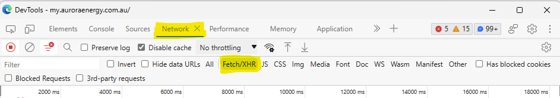
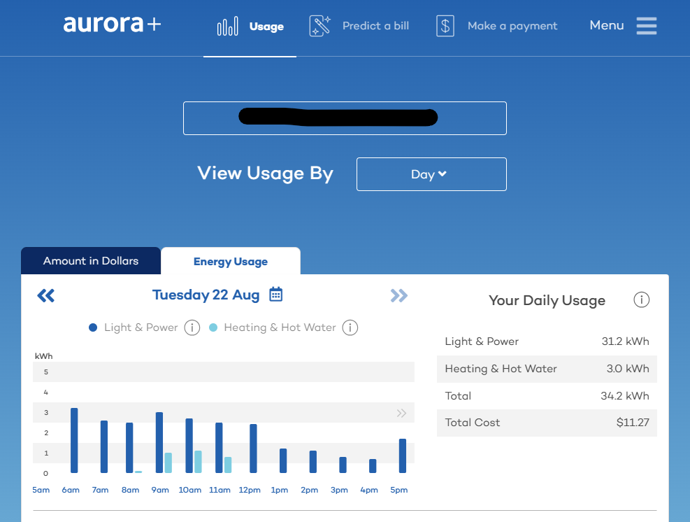
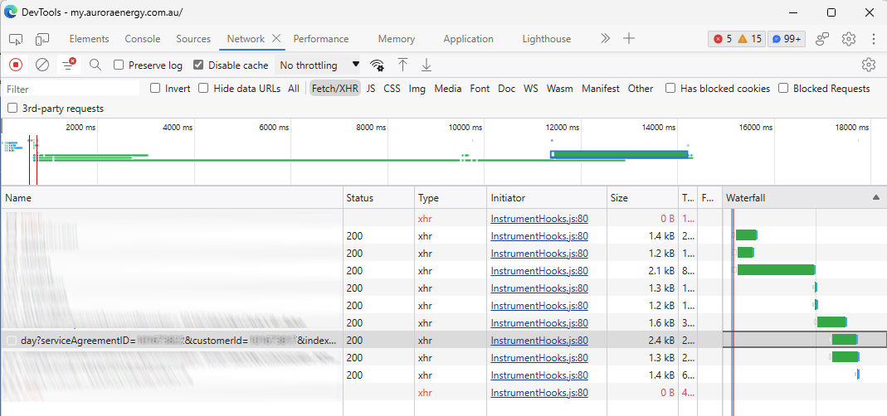
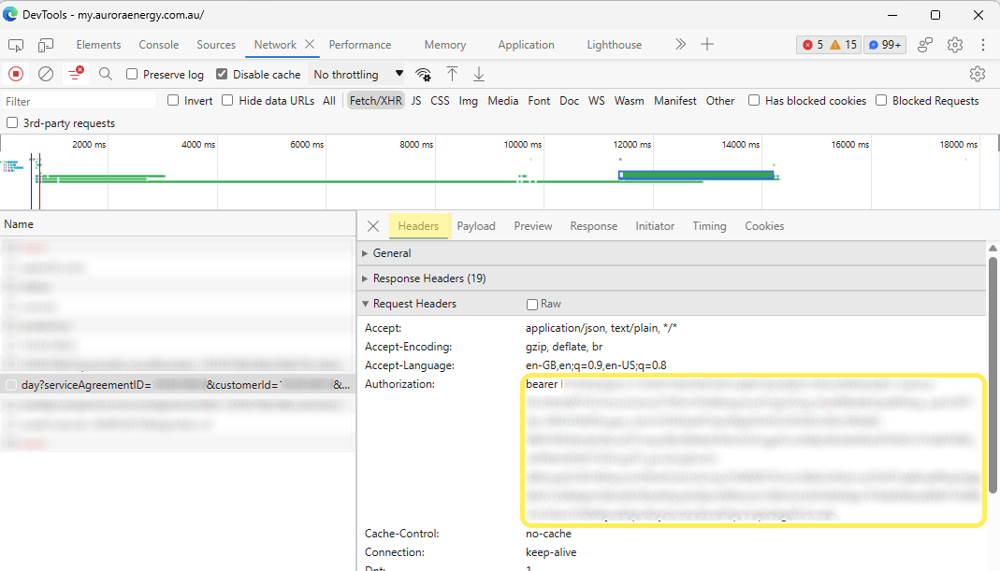

# AuroraPlusData
Tools to extract and model Aurora+ usage across different plans.

This project arose out of an interest in knowing if our household would be better off switching to the Peak / Off-Peak tarrif, rather than the fixed T31 and T41 tarrifs.

You will need to be an existing Aurora+ customer on the fixed tarrif.

It will download your historical usage data, then work out for each day, how much energy you used in the peak and off-peak times.  You will need to take the final step in a spreadsheet by multiplying the usage values against the current tarrif prices.

## Instructions:

### Finding Aurora+ parameters.

To keep this project simple, it does not authenticate you with Aurora+, but rather requires you to authenticate and manually extract some key values.

1. Open the Aurora+ app on your computer using Edge or Chrome, and login. (https://my.auroraenergy.com.au/)
2. Open the DevTools window by pressing [Ctrl]+[Shift]+[I]
3. GoTo the Network tab, and select the Fetch/XHR filter

4. In the browser, navigate to the usage view, and ensure you're viewing usage by Day.

5. In the DevTools window, you should see a series of network requests.  Look for  one that starts with: `day?serviceAgreementId`.  Copy and save for later, the numeric values of serviceAgreementId and customerId.

6. Click the `day?` line, and select the Headers tab.

7.  Look for the Authorization field.  Copy and save for later, the bearer token value (excluding the proceeding "bearer " text)

Note that the bearer token will change after a period of time. As such, if you come back after several days, you may need to check the token value hasn't changed.  Also, it should stand to reason, don't share this value with anyone else.  It is what tells the Aurora+ servers that you are you.

### Installing and configuring the downloader.
1. Install Node if it's not already installed (https://nodejs.org/) on your computer.
2. Download this project, and open a terminal in its root.
3. Install project dependencies by executing: `npm i`.
4. Edit downloadHourlyUsage.js, and substiture the following for the values identified earlier:
	a) YOUR_BEARER_TOKEN
	b) YOUR_SERVICE_AGREEMENT_ID
	c) YOUR_CUSTOMER_ID

## Running the software.

### Download Hourly Usage.
This tool downloads raw Aurora+ daily usage.

By default the last 365 days of usage will be downloaded.  This can be altered with the `numDaysToRetrieve` config parameter.

From a command prompt in the project root, execute the following command:

`node downloadHourlyUsage.js`

This will take a while to complete, but will save the JSON response to `output.json` which contains the raw daily data.

### Compute daily usage.
This tool uses the raw data download, and generates a CSV with peak, off-peak, T31 and T41 usage stats on a daily basis, which can be further analysed in Excel or other tooling.

From the command prompt in the project root, execute the follwoing command:

`node computerDailyUsage.js`

The output will be saved to `daySummary.csv`.

